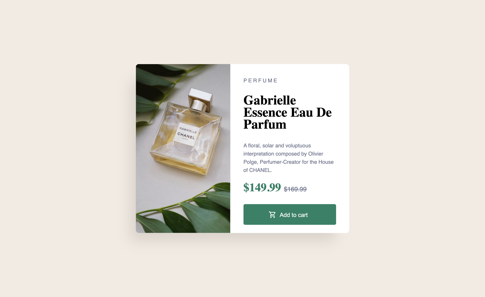

# Frontend Mentor - Product preview card component solution

This is a solution to the [Product preview card component challenge on Frontend Mentor](https://www.frontendmentor.io/challenges/product-preview-card-component-GO7UmttRfa).

## Table of contents 

- [Overview](#overview)
  - [The challenge](#the-challenge)
  - [Screenshot](#screenshot)
  - [Links](#links)
- [My process](#my-process)
  - [Built with](#built-with)
- [Author](#author)

## Overview

### The challenge

Users should be able to:

- View the optimal layout depending on their device's screen size
- See hover and focus states for interactive elements

### Screenshots

### Desktop

## Mobile

### Links
- Live Site URL: [Chanel landing page](https://lewis-ingleton.github.io/chanel-landing-page-card/)

## My process

### Built with

- Semantic HTML5 markup
- CSS custom properties
- Flexbox
- Mobile-first workflow using media queries

## Author

- Frontend Mentor - [Lewis Ingleton](https://www.frontendmentor.io/profile/Phillip-flop)
- LinkedIn - [Lewis Ingleton](https://www.linkedin.com/in/lewis-ingleton/)

